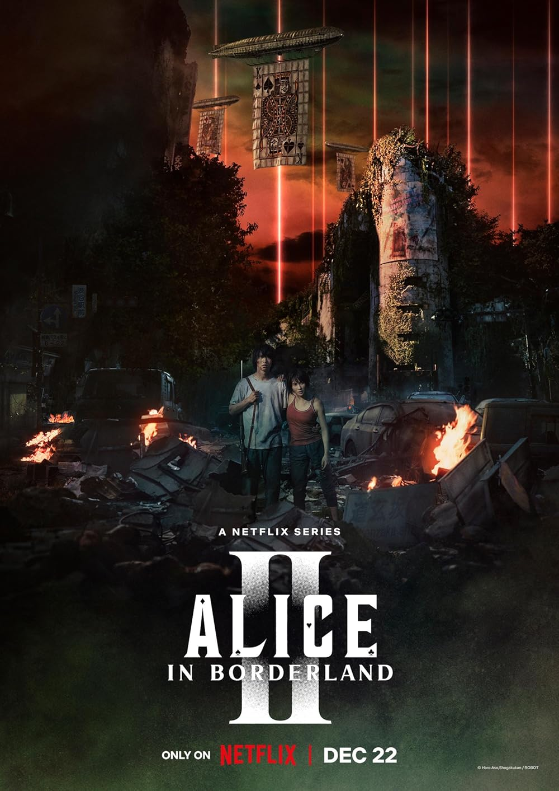

I'm not usually into horror or violence, but [Alice in Borderland](https://www.imdb.com/title/tt10795658/) came *strongly* recommended by a good friend so I *had* to watch it. The very first episode got me instantly hooked and the very last episode provided me with satisfying answers, but sadly, everything in between feels like a waste of time. ☠️

Without spoiling all the fun, the plot is basically this: suddenly, a bunch of people find themselves in an alternate version of Tokyo, where they need to compete in games in order to survive.

While the photography and the editing were good, I did not particularly like the acting. The two main characters had zero chemistry (Arisu and Usagi) and their love story didn't convince me. All the dialogues had an emotional orchestral background music which was driving me insane by the end of the 32 episodes. I really can't stand the sound of sad violins no more. 🎻

The first season had an interesting development and laid out the survival games' rules quite clearly. What was not clear at the end of the season was why this situation was happening to them, and if they could ever go back to their normal lifes. I was genuinely afraid of this being yet another installment of *Lost*, but my friend *guaranteed* I'd have answers by the end of the show, so I powered through season two.

The second season felt specially long and repetitive. Too much screen time was given to the games and one in particular, the "King of Spades", felt utter pointless and chaotic. The entire show could honestly fit in ONE season of 12 episodes, beginning to end, no loose ends. Despite all the stretch, the season finale did close the plot and answer all questions satisfactorily — so much so, I do not understand why a third season is coming to Netflix later this year. ♠️