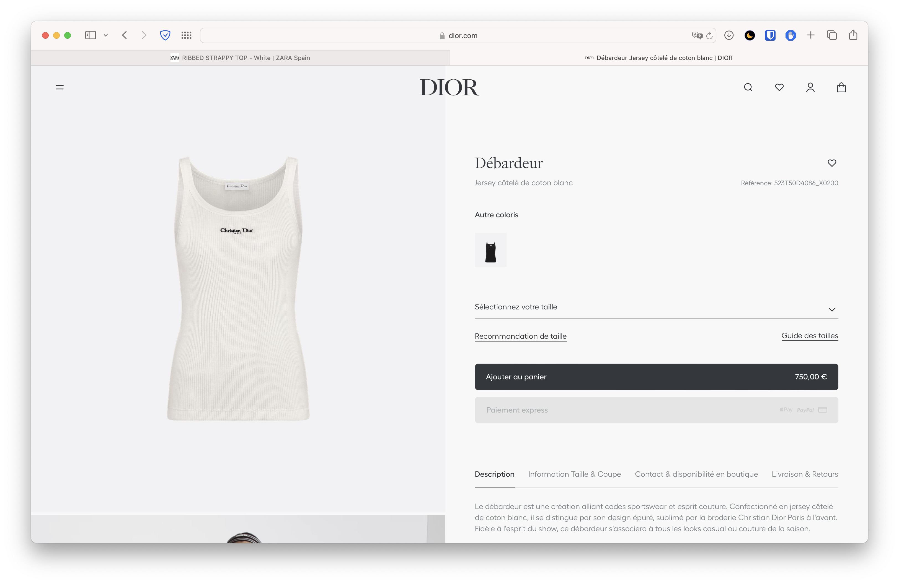

Early on in my sewing journey, I made the mistake of buying a loooot of fabric from [Les Coupons de St-Pierre](https://www.google.com/search?client=safari&rls=en&q=les+coupons+de+saint+pierre&ie=UTF-8&oe=UTF-8), something like 30 different 3m long cuts of fabric. I had to get a dresser from ikea just to store it all! Ok, I just remembered I did the very same thing when I got into crochet and bought maybe 100 different skeins at once, back when I still lived in Brazil! I took all of that with me when I moved to Sweden, but donated most of it when I moved to Spain. What's wrong with me?? 🧶

Luckily I did buy some high quality stuff like cotton-linen blends; and really nice cotton-elastane knits for making t-shirts; but also got some really bizarre sheer polyester kinds of fabrics that I don't know what to do with, and can't bring myself to ever part with. From time to time I look at them and try to come up with ideas for projects to sew but, at least for me, it's better to do it the other way round: have an idea, find a pattern, get the fabric. So now, whenever I want to sew, I go shopping in my own Ikea dresser that I had to buy uniquely for the purpose of storing this absurd amount of fabric, lol. I'm only allowed to buy more fabric if I don't have something that works, and now I only buy the amount needed for the project. Lesson learned!

Anyway, summer is here and I feel I'm missing some items in my wardrobe, definitely a skirt or two, some tees, maybe some more dresses. Whenever I go to a store or browse online, I just feel everything is so... poorly made? Everything is so expensive for the amount and quality of fabric used, the finishes are just ok (raise your hand if you never found a loose thread!), not to mention the problematics of [semi-slave labour](https://www.imdb.com/title/tt3162938) and [environmental costs](https://www.greenpeace.org/africa/en/blog/54589/how-fast-fashion-is-fuelling-the-fashion-waste-crisis-in-africa/).

An innocent bystander might say, well, don't buy from Zara then. Buy from a place like **Dior**. They use only the highest quality fabrics and their clothes are hand-sewn in Italy by a very elegant seamstress. That's why it is expensive. Right? Well, [not really](https://remake.world/stories/are-luxury-brands-more-sustainable/). Often, luxury brands use the same factories as their fast fashion competitors; sometimes, they will get the garment made in a poor country and slap a label once it arrives in Europe, thus calling the entire thing ["Made in Europe"](https://luxonomy.net/luxury-made-in-china-the-great-scandal-of-the-industry/); other times, they might sew in European factories, but source their cotton from slave labour regions in [China]((https://directory.goodonyou.eco/brand/dior)); and though they used to put out two collections a year, they now work on eight collections.

Isn't that the same as fast-fashion, labelled as luxury?

Aditionally, look at the price tag in the image above. I'll let that sink in for a moment.

Seven hundred fifty fricking euros for a tank top? Excuse me?! No. Just no. I refuse. I will make it myself.

For the pattern, I think [Blomma Tank](https://paradisepatterns.com/products/blomma-tank-pdf-sewing-pattern-sizes-a-l-bust-30-60-athletic-style-top-b-cup-and-d-cup-options) from Paradise Patterns will look perfect. For the fabric, there are a ton of options: [basic ribbed knit](https://takoy.es/tela-de-punto-canale-oskar-nuevo-blanco-1-ns-15378), [certified organic](https://www.nastasianash.com/producto/tela-de-punto-organica-blanca-con-elastano/?attribute_cantidad=Unidad+0%2C5+m), and even [rescued](https://www.kilotela.com/producto/tela-punto-canale-algodon-crudo/) fabric. For my size, I'll use less than a meter of fabric so we're looking at 12-16 euros in costs plus 2.50 for the [thread](https://www.merceriabotton.es/hilo-de-coser/hilo-coser-gutermann-tergal-100m-19741.html#/4567-hilos_gutermann-blanco_800). So, a little bit more expensive than the Zara top below, but waaaay cheaper than the Dior above.

When sewing your own clothes, time is the most relevant factor. In my case, I buy digital patterns in PDF, which I then need to print and assemble -- this is the most annoying part, for sure. I'm really interested in a skirt, but am not looking forward to taping together 64 sheets of paper! To save time for future me, I print all the sizes, then trace only the size I'll be sewing on tracing paper and do any alterations then. I find it helps in case I need to grade between sizes, or if I want to sew for another person, or if my size changes. I heard some people get to their old age fitting in the same jeans they wore in high school. Not me!

Then comes preparing the fabric, washing, line drying, ironing, cutting. Finally we are ready for the best part, the sewing machine! But even this is not all roses: sew one side, stop, press the seam, finish the seam, then sew the other side, and so on. And I'm a slow sewist too. All of this is to say: in terms of financial costs, it is not cheaper than fast-fashion, but it is not absurd either. The real cost is in terms of time. However, in this case, investing additional time does not equal "wasted time". I find taking my time to do all of the steps, to press the seams, to go at it slowly and do rip the stitches and re-do if needed, all of that time equals better looking clothes that (in all honesty) look better than anything store-bought. Every garment I've sewn means something to me, because I invested some money and a ton of time in it!

I guess in my next posts I will showcase some of my creations :)
